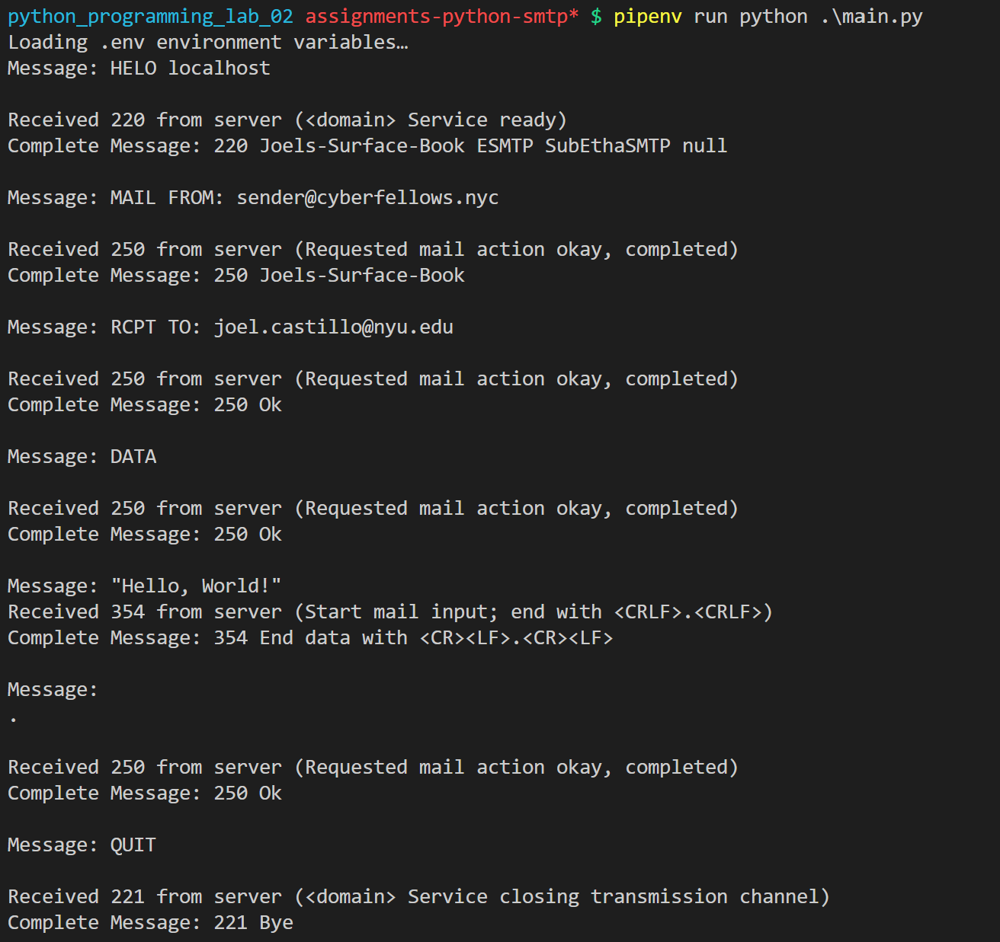
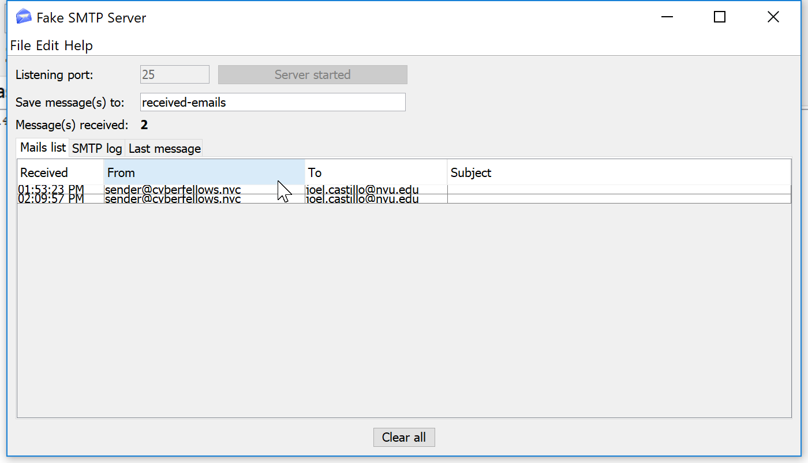
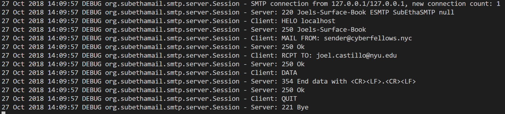
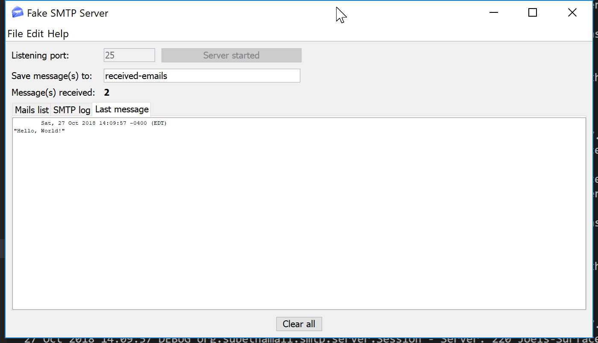

Joel Benjamin Castillo (jc5383)  
CS6843 - Computer Networking  
Prof. Rafail Portnoy  
<p align=center><strong>Lab 2: SMTP Client Lab</strong></p>

## Python Code (`main.py`)
```python
from socket import socket, AF_INET, SOCK_STREAM
from os import getenv, environ

# CONSTANTS
DEBUG = False
DEFAULT_MAIL_SERVER = "127.0.0.1"
DEFAULT_MAIL_PORT = 25
DEFAULT_HOSTNAME = 'localhost'
DEFAULT_MAIL_SENDER = 'cs6843@nyu.edu'
DEFAULT_MAIL_RECIPIENT = 'cs6843@nyu.edu'
DEFAULT_MSG_CONTENT = "\r\n I love computer networks!"
DEFAULT_DATA_LENGTH = 1024

## SMTP Messages
HELO_COMMAND = "HELO {name}\r\n"
MAIL_FROM_COMMAND = "MAIL FROM: {mail_sender}\r\n"
RCPT_TO_COMMAND = "RCPT TO: {mail_recipient}\r\n"
DATA_COMMAND = "DATA\r\n"
MSG_CONTENT = "{msg_content}"
END_OF_MSG_CONTENT = "\r\n.\r\n"
QUIT_COMMAND = "QUIT\r\n"

## SMTP Status Codes
SMTP_STATUS_CODES = {
    "200": "(nonstandard success response, see rfc876)",
    "211": "System status, or system help reply",
    "214": "Help message",
    "220": "<domain> Service ready",
    "221": "<domain> Service closing transmission channel",
    "250": "Requested mail action okay, completed",
    "251": "User not local; will forward to <forward-path>",
    "252": "Cannot VRFY user, but will accept message and attempt delivery",
    "354": "Start mail input; end with <CRLF>.<CRLF>",
    "421": "<domain> Service not available, closing transmission channel",
    "450": "Requested mail action not taken: mailbox unavailable",
    "451": "Requested action aborted: local error in processing",
    "452": "Requested action not taken: insufficient system storage",
    "500": "Syntax error, command unrecognised",
    "501": "Syntax error in parameters or arguments",
    "502": "Command not implemented",
    "503": "Bad sequence of commands",
    "504": "Command parameter not implemented",
    "521": "<domain> does not accept mail (see rfc1846)",
    "530": "Access denied (???a Sendmailism)",
    "550": "Requested action not taken: mailbox unavailable",
    "551": "User not local; please try <forward-path>",
    "552": "Requested mail action aborted: exceeded storage allocation",
    "553": "Requested action not taken: mailbox name not allowed",
    "554": "Transaction failed",
}
SERVICE_READY = "220"
ACTION_COMPLETED = "250"


def setup_mail_server(
    server: str = DEFAULT_MAIL_SERVER, port: int = DEFAULT_MAIL_PORT
) -> socket:
    """Setup a connection to another SMTP Mail Server.
        server (str, optional): Defaults to DEFAULT_MAIL_SERVER. Address of the mail server to connect with
        port (int, optional): Defaults to DEFAULT_MAIL_PORT. Port where the mail server is listening.
    
    Returns:
        socket.socket: A socket with a connection to the mail server
    """
    client_socket = socket(AF_INET, SOCK_STREAM)
    connect_tuple = (server, port)
    client_socket.connect(connect_tuple)

    return client_socket


def send_message(client_socket: socket, message: str) -> None:
    """Send a message to the server

    Args:
        client_socket (socket): Socket with connection to mail server
        message (str): Message to be sent to server.
    """
    client_socket.send(message.encode())


def get_response(
    client_socket: socket, length: int = DEFAULT_DATA_LENGTH
) -> str:
    """Retrieve data from the socket.
    
    Args:
        client_socket (socket): Client socket with TCP Connection to mail server
        length (int, optional): Defaults to DEFAULT_DATA_LENGTH. Amount of data to retrieve
    
    Returns:
        str: Decoded message from server
    """
    return client_socket.recv(length).decode()


def check_response(data: str, expected_status: str) -> None:
    """Check the response and print out any errors. 
    
    Args:
        data (str): Data received from the server.
        expected_status (str): Expected response codes
    """
    # Check first three characters of response against status code
    code = data[:3]

    if code == expected_status:
        print(
            "Received {expected_status} from server ({status_meaning})\nComplete Message: {data}".format(
                expected_status=expected_status,
                status_meaning=SMTP_STATUS_CODES[code],
                data=data,
            )
        )

    else:
        print(
            "{expected_status} not received from server\nReceived: {code} ({code_meaning})\nComplete Message:\n{data}".format(
                expected_status=expected_status,
                code=code,
                code_meaning=SMTP_STATUS_CODES[code],
                data=data,
            )
        )

def load_env_file(path: str = ".env", debug: bool = DEBUG):
    """Load a .env file and store the variables in the environment. 
        path (str, optional): Defaults to ".env". The path to the .env file.
    """
    with open(path, 'r') as _:
        vars = _.readlines()
        vars = [var.strip() for var in vars]

    for var in vars:
        if '=' not in var or not var:
            continue
        name = var.split('=')[0]
        value = var.split('=')[1]
        environ[name] = value
    if debug:
        print(environ)


def main():
    # 0. Load .env
    load_env_file()

    # 0. Determine if debug is active
    debug = getenv('DEBUG', DEBUG)

    # 0. Get SMTP Variables (Server, Port)
    mail_server = getenv('SERVER', DEFAULT_MAIL_SERVER)
    mail_port = int(getenv('PORT', DEFAULT_MAIL_PORT))

    # 0. Get Hostname
    hostname = getenv('HOSTNAME', DEFAULT_HOSTNAME)

    # 0. Get Mail Sender
    mail_sender = getenv('MAIL_SENDER', DEFAULT_MAIL_SENDER)

    # 0. Get Mail Recipient
    mail_recipient = getenv('MAIL_RECIPIENT', DEFAULT_MAIL_RECIPIENT)

    # 0. Get Message
    msg_content = getenv('MSG_CONTENT', DEFAULT_MSG_CONTENT)

    # 1. Setup connection to mail server
    client_socket = setup_mail_server(mail_server, mail_port)

    # 2. Send HELO 
    helo_msg = HELO_COMMAND.format(name=hostname)
    if debug:
        print("Message: {message}".format(message=helo_msg))
    send_message(client_socket, helo_msg)

    # 3. Check HELO Response - Expecting a 220 Status Code
    helo_resp = get_response(client_socket)
    check_response(helo_resp, "220")

    # 4. Send MAIL FROM
    mail_from_msg = MAIL_FROM_COMMAND.format(mail_sender=mail_sender)
    if debug:
        print("Message: {message}".format(message=mail_from_msg))
    send_message(client_socket, mail_from_msg)

    # 5. Check MAIL FROM Response - Expecting 250 Status Code
    mail_from_resp = get_response(client_socket)
    check_response(mail_from_resp, "250")

    # 6. Send RCPT TO
    rcpt_to_msg = RCPT_TO_COMMAND.format(mail_recipient=mail_recipient)
    if debug:
        print("Message: {message}".format(message=rcpt_to_msg))
    send_message(client_socket, rcpt_to_msg)

    # 7. Check RCPT TO Response - Expecting 250 Status Code
    rcpt_to_resp = get_response(client_socket)
    check_response(rcpt_to_resp, "250")

    # 8. Send DATA
    data_msg = DATA_COMMAND
    if debug:
        print("Message: {message}".format(message=data_msg))
    send_message(client_socket, data_msg)

    # 9. Check RCPT TO Response - Expecting 250 Status Code
    data_resp = get_response(client_socket)
    check_response(data_resp, "250")

    # 10. Send Message Content
    msg_content = MSG_CONTENT.format(msg_content=msg_content)
    if debug:
        print("Message: {message}".format(message=msg_content))
    send_message(client_socket, msg_content)

    # 11. Check Message Response - Expecting 354 Status Code
    msg_content_resp = get_response(client_socket)
    check_response(msg_content_resp, "354")

    # 12. Send End of Message String
    end_of_msg_content = END_OF_MSG_CONTENT
    if debug:
        print("Message: {message}".format(message=end_of_msg_content))
    send_message(client_socket, end_of_msg_content)

    # 13. Check Message Response - Expecting 250 Status Code
    end_of_msg_content_resp = get_response(client_socket)
    check_response(end_of_msg_content_resp, "250")

    # 14. Send QUIT
    quit_msg = QUIT_COMMAND
    if debug:
        print("Message: {message}".format(message=quit_msg))
    send_message(client_socket, quit_msg)

    # 15. Check QUIT Response - Expecting 221 Status Code
    quit_msg_resp = get_response(client_socket)
    check_response(quit_msg_resp, "221")

if __name__ == '__main__':
    main()
```

## `.env` File
```bash
DEBUG=True
SERVER=127.0.0.1
PORT=25
MAIL_SENDER=sender@cyberfellows.nyc
MAIL_RECIPIENT=joel.castillo@nyu.edu
MSG_CONTENT="Hello, World!"
```

## Client Output


## Server Message Log


## Server SMTP Log


## Email Message
