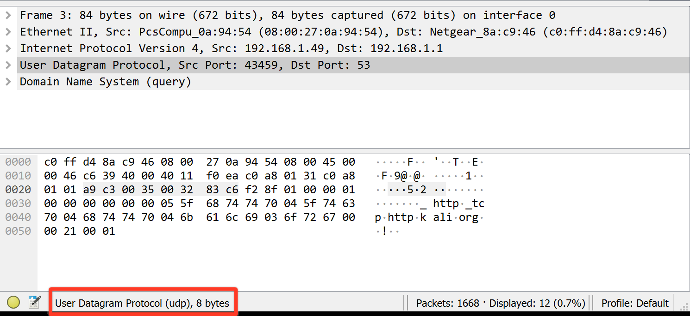

Joel Benjamin Castillo (jc5383)  
CS6843 - Computer Networking  
Prof. Rafail Portnoy  

<strong>Wireshark Lab - UDP</strong>

1. Select <em>one</em> UDP packet from your trace. From this packet, determine how many fields there are in the UDP header. (You shouldn't look in the textbook!) Answer these questions directly from what you observe in the packet trace.) Name these fields.
Fields
- Source Port
- Destination Port
- Length
- Checksum

2. By consulting the displayed information in Wireshark’s packet content field for this packet, determine the length (in bytes) of each of the UDP header fields.
- 2 bytes

3. The value in the Length field is the length of what? (You can consult the text for this answer). Verify your claim with your captured UDP packet.
Specifies the length in bytes of the UDP header + data. 
As shown in the screenshot, there are 8 bytes in the UDP header + 42 bytes in the DNS data, totaling 50 bytes in the UDP Data + Header (the length field.)

4. What is the maximum number of bytes that can be included in a UDP payload? (Hint: the answer to this question can be determined by your answer to 2. above)
Since the length header field can only store 2 bytes, the largest number that can be represented by that is 1111111111111111 (in binary), or 65535 (in base 10).
5. What is the largest possible source port number? (Hint: see the hint in 4.)
Since the source port number header field can only store 2 bytes, the largest number that can be represented by that is 1111111111111111 (in binary), or 65535 (in base 10).
6. What is the protocol number for UDP? Give your answer in both hexadecimal and decimal notation. To answer this question, you’ll need to look into the Protocol field of the IP datagram containing this UDP segment (see Figure 4.13 in the text, and the discussion of IP header fields).
UDP - 17 (0x11)

7. Examine a pair of UDP packets in which your host sends the first UDP packet and the second UDP packet is a reply to this first UDP packet. (Hint: for a second packet to be sent in response to a first packet, the sender of the first packet should be the destination of the second packet). Describe the relationship between the port numbers in the two packets.
The source port from the original packet is the destination port in the second packet. The client opens the port and waits for a response on it to close the connection.

