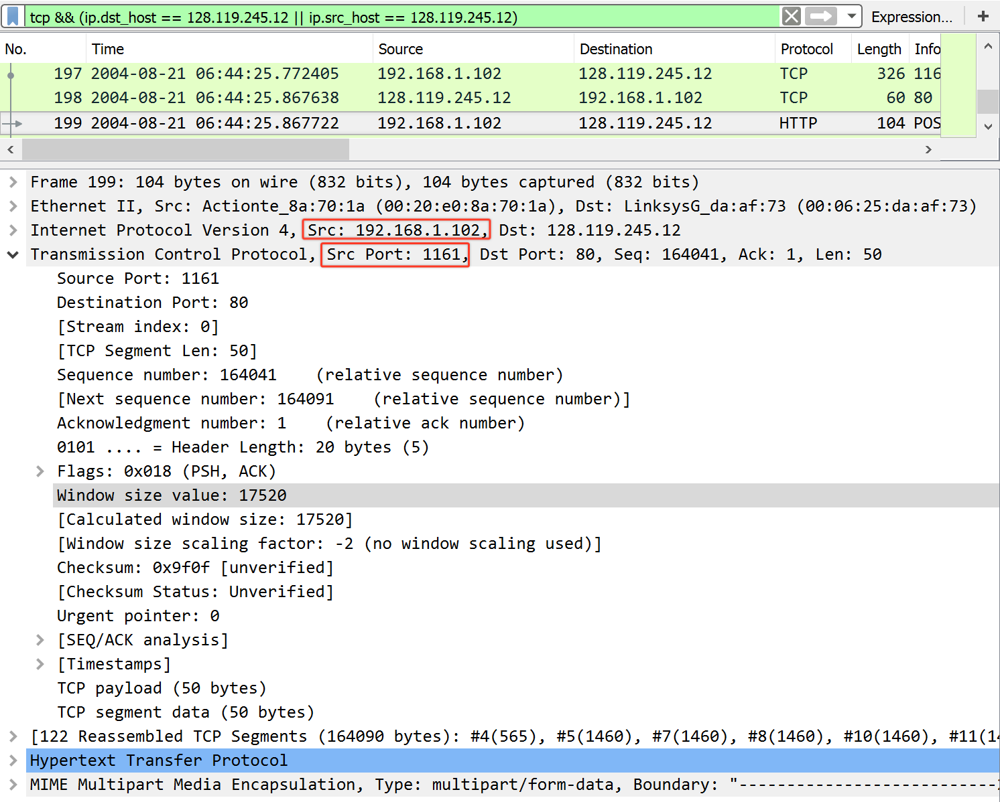
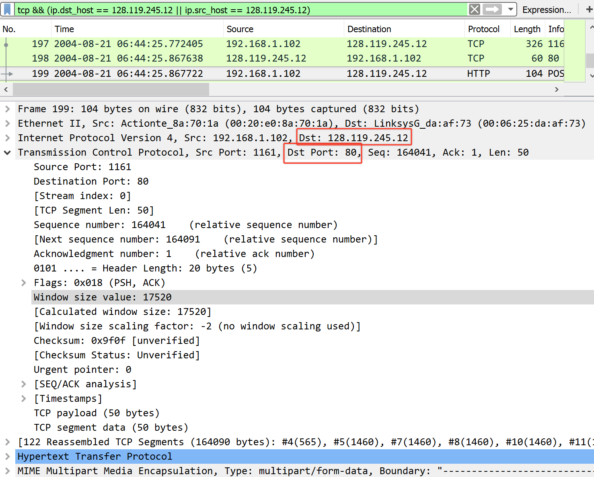
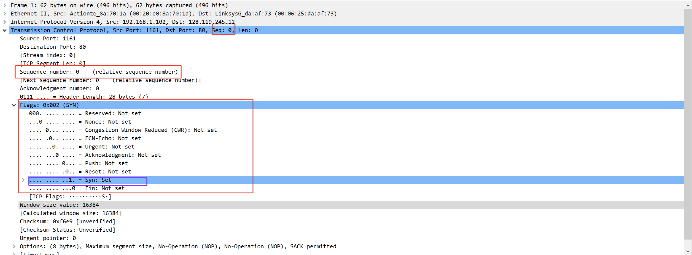
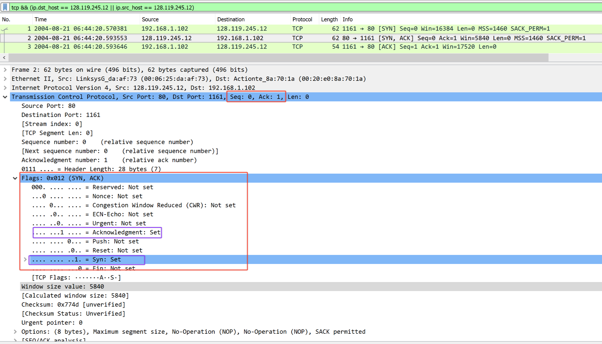
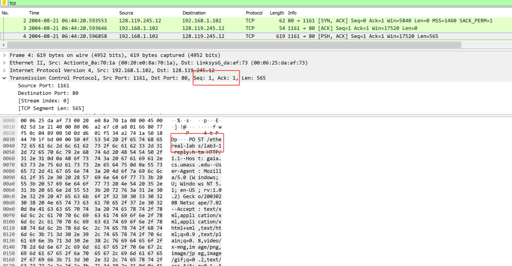
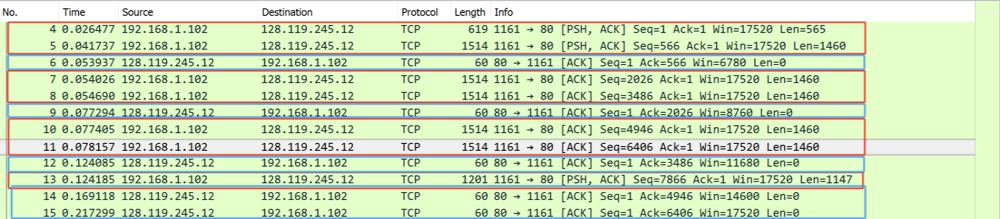
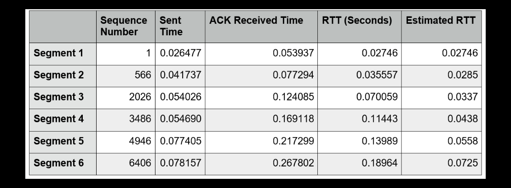
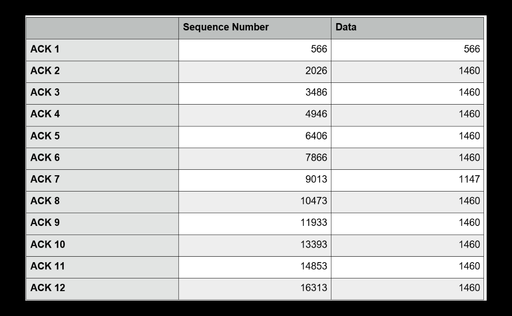
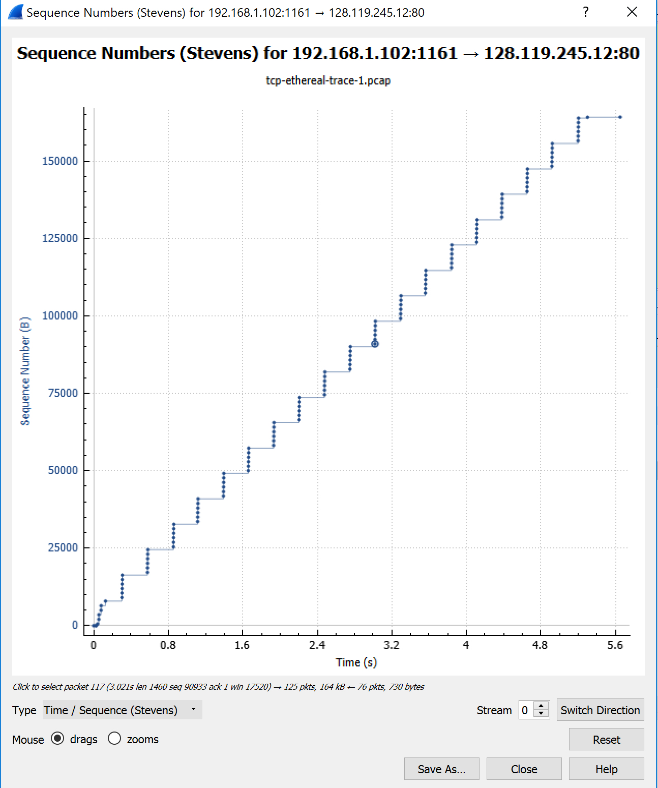

Joel Benjamin Castillo (jc5383)  
CS6843 - Computer Networking  
Prof. Rafail Portnoy  
<p align=center><strong>Wireshark Lab - TCP</strong></p>

1. What is the IP address and TCP port number used by the client computer (source) that is transferring the file to gaia.cs.umass.edu?  To answer this question, it’s probably easiest to select an HTTP message and explore the details of the TCP packet used to carry this HTTP message, using the “details of the selected packet header window” (refer to Figure 2 in the “Getting Started with Wireshark” Lab if you’re uncertain about the Wireshark windows.  
Source IP: `192.168.1.102`  
Source Port: `1161`  

2. What is the IP address of gaia.cs.umass.edu? On what port number is it sending and receiving TCP segments for this connection?  
Destination IP: `128.119.245.12`  
Destination Port: `80`  

3. What is the IP address and TCP port number used by your client computer (source) to transfer the file to gaia.cs.umass.edu?
I couldnt get this to work on my VM.
4. What is the sequence number of the TCP SYN segment that is used to initiate the TCP connection between the client computer and gaia.cs.umass.edu?  What is it in the segment that identifies the segment as a SYN segment?  
Sequence Number: `0`  
The `SYN` flag is the only flag set in the TCP packet, identifying it as a `SYN` packet.  

5. What is the sequence number of the SYNACK segment sent by gaia.cs.umass.edu to the client computer in reply to the SYN?  What is the value of the Acknowledgementfield in the SYNACK segment?  How did gaia.cs.umass.edu determine that value? What is it in the segment that identifies the segment as a SYNACK segment?
Sequence Number: `0`  
The value of the `ACK` field in the `SYNACK` segment is 1. This is determined by adding 1 to the original sequence number of the `SYN` segment on the server. Both the `SYN` and `ACK` flags are set to `1`, marking the segment as a `SYNACK` segment.

6. What is the sequence number of the TCP segment containing the HTTP POST command?  Note that in order to find the POST command, you’ll need to dig into the packet content field at the bottom of the Wireshark window, looking for a segment with a “POST” within its DATA field.  
Sequence Number: `1`

7. Consider the TCP segment containing the HTTP POST as the first segment in the TCP connection. What are the sequence numbers of the first six segments in the TCP connection (including the segment containing the HTTP POST)?  At what time was each segment sent?  When was the ACK for each segment received?  Given the difference between when each TCP segment was sent, and when its acknowledgement was received, what is the RTT value for each of the six segments?  What is the EstimatedRTTvalue (see Section 3.5.3, page 242 in text) after the receipt of each ACK?  Assume that the value of the EstimatedRTTis equal to the measured RTT for the first segment, and then is computed using the EstimatedRTTequation on page 242 for all subsequent segments.Note:Wireshark has a nice feature that allows you to plot the RTT for each of the TCP segments sent.  Select a TCP segment in the “listing of captured packets” window that is being sent from the client to the gaia.cs.umass.edu server.  Then select: Statistics->TCP Stream Graph->Round Trip Time Graph.  


```
EstimatedRTT = .875 * EstimatedRTT + .125 * SampleRTT
Segment 1: RTT for Segment 1 = .02746
Segment 2: .875 * .02746 + .125 * .035557 = .0285s
Segment 3: .875 * .0285 + .125 * .070059 = .0337s
Segment 4: .875 * .0377 + .125 * .11443 = .0438s
Segment 5: .875 * .0438 + .125 * .13989 = .0558s
Segment 6: .875 * .0558 + .125 * .19064 = .0725s
```
8. What is the length of each of the first six TCP segments?
```
Segment 1: 565 bytes
Segment 2: 1460 bytes
Segment 3: 1460 bytes
Segment 4: 1460 bytes
Segment 5: 1460 bytes
Segment 6: 1460 bytes
```
9.  What is the minimum amount of available buffer space advertised at the received for the entire trace?  Does the lack of receiver buffer space ever throttle the sender?
Minimum Amount of Buffer Space: `17536 bytes`
No, the sender is never throttled.
10.    Are there any retransmitted segments in the trace file? What did you check for (in the trace) in order to answer this question?
No there are not. I checked to see if the sequence numbers were in order. If a segment was retransmitted, the number of that segment would be smaller than the neighboring segments.
11.    How much data does the receiver typically acknowledge in an ACK?  Can you identify cases where the receiver is ACKing every other received segment (see Table 3.2 on page 250 in the text).
`1460 bytes`. The difference between each ACK is about 1460


12.      What is the throughput (bytes transferred per unit time) for the TCP connection?  Explain how you calculated this value
`Throughput` = `164090/5.6511` = `29036 B/s`
The total amount of data is 1 less tha  final ACK # divided by the total connection time.

13.      Use the Time-Sequence-Graph(Stevens) plotting tool to view the sequence number versus time plot of segments being sent from the client to the gaia.cs.umass.edu server.  Can you identify where TCP’s slowstart phase begins and ends, and where congestion avoidance takes over?  Comment on ways in which the measured data differs from the idealized behavior of TCP that we’ve studied in the text.

TCP slowstart starts at the beginning of the transmission with the HTTP POST segment. The window size can be lower bound is estimated by looking at the amount of unACKd data. This is the amount of data that has not been successfully transferred (transferred and confirmed). The size of this window has to be greater that 8192 bytes, since the amount of unACKd data never exceeds 8192 bytes. That means we can't determine when slowstart ends and congestion control begins because data is not sent in a way that would cause congestion control to start. AKA the application doesn't send more than 8192 bytes at a time.  
According to the text, TCP behavior assumes that the sender is always sending data and does not wait for an ACK. In this case, it looks like the application waits for an ACK before sending additional data, even if there is still space in the transmission window. This means that the transmission is complete before the end of the slowstart phase, and that the transfer is slow.
14.      Answer each of two questions above for the trace that you have gathered when you transferred a file from your computer to gaia.cs.umass.edu
I wasn't able to get the trace working properly on my computer.