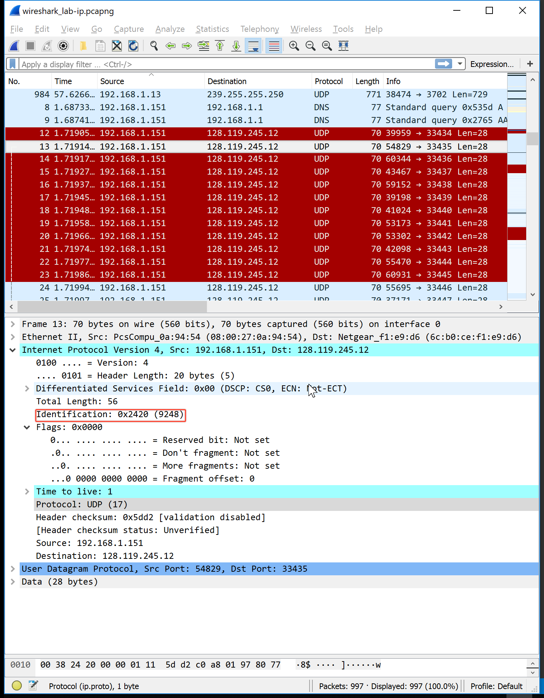

Joel Benjamin Castillo (jc5383)  
CS6843 - Computer Networking  
Prof. Rafail Portnoy  

<strong>Wireshark Lab - IP</strong>

1. Select the first ICMP Echo Request message sent by your computer, and expand the Internet Protocol part of the packet in the packet details window.  What is the IP address of your computer?
    IP Address: `192.168.1.151`
    
2. Within the IP packet header, what is the value in the upper layer protocol field?
   Protocol: `UDP`
   
3. How many bytes are in the IP header? How many bytes are in the payload of the IP datagram?  Explain how you determined the number of payload bytes.
   IP Header: `20 bytes`
   Payload: `36 bytes`
   The total length of the datagram is `56 bytes` and the header is `20 bytes` therefore the payload must be `36 bytes`
   
4. Has this IP datagram been fragmented?  Explain how you determined whether or not the datagram has been fragmented.
   No. The Fragment offset is 0 in the flags for the IP packet.
   
5. Which fields in the IP datagram always change from one datagram to the next within this series of ICMP messages sent by your computer?
   The identification, frame, and header checksum fields change.
    
    
6. Which fields stay constant?  Which of the fields must stay constant? Which fields must change?  Why?
   IPv4, Length of the header, Source IP, Destination IP and the protocol (always using UDP). The header checksum and the identification change each time to verify the packets and keep track of header changes.
7. Describe the pattern you see in the values in the Identification field of the IP datagram
   The identification field increases by one in each echo request.
8. What is the value in the Identification field and the TTL field?
   Identification Field: `0x5f16` `(24342)`
   TTL Field: `64`
    
9.  Do these values remain unchanged for all of the ICMP TTL-exceeded replies sent to your computer by the nearest (first hop) router?  Why?
    TTL does not change, but the identification field does. Identification field has to change if the packets are unique (non-fragmented) the identification field needs to be unique. The TTL field doesn't change because the TTL for the first hop router is always the same.
10. Find the first ICMP Echo Request message that was sent by your computer after you changed the Packet Size in pingplotterto be 2000. Has that message been fragmented across more than one IP datagram?  [Note: if you find your packet has not been fragmented, you should download the zip file http://gaia.cs.umass.edu/wireshark-labs/wireshark-traces.zipand extract the ip-ethereal-trace-1packet trace. If your computer has an Ethernet interface, a packet size of 2000 should cause fragmentation.]
    Yes, it is.
    
11. Print out the first fragment of the fragmented IP datagram. What information in the IP header indicates that the datagram been fragmented?  What information in the IP header indicates whether this is the first fragment versus a latter fragment?  How long is this IP datagram?
    The flag for more segments is set in the header. The offset is 0, which indicates that this is the first packet. The total length of the datagram is 1500bytes. 
    
    
12. Print out the second fragment of the fragmented IP datagram. What information in the IP header indicates that this is not the first datagram fragment?  Are the more fragments?  How can you tell?
    This fragment has an offset of 1480. There are no more fragments because the flag for more fragments is not set.
    
    
13. What fields change in the IP header between the first and second fragment?
    Length, Flags Set, Fragment Offset, and Header Checksum
14. How many fragments were created from the original datagram?
    3 fragments 
    
    
    
15. What fields change in the IP header among the fragments?
    Fragment Offset (0, 185, 370)
    Total Length: 1500 for the first two packets, 540 for the last one
    More Fragments: First Two Packets it is set, Not set in the last packet