Joel Benjamin Castillo (jc5383)  
CS6843 - Computer Networking  
Prof. Rafail Portnoy  

<strong>Wireshark Lab - Ethernet</strong>

## Ethernet Frames

1. What is the 48-bit Ethernet address of your computer?
`f0:6e:0b:d5:b4:de`
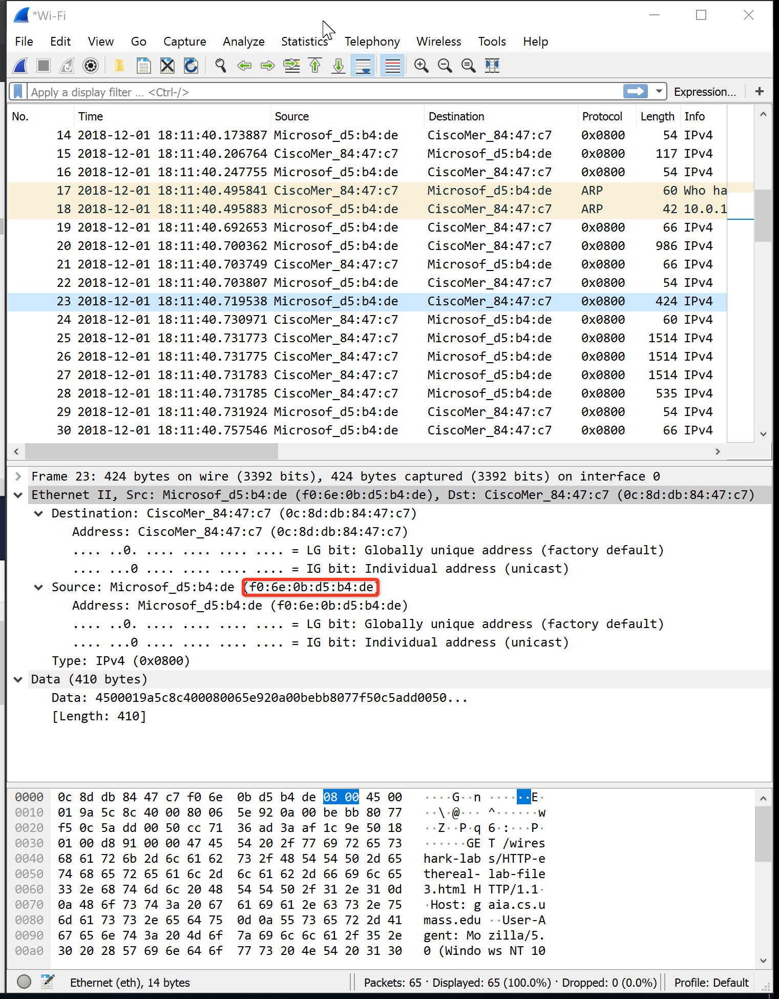

2. What is the 48-bit destination address in the Ethernet frame? Is this the Ethernet address of gaia.cs.umass.edu? (Hint: the answer is no). What device has this as its Ethernet address? [Note: this is an important question, and one that students sometimes get wrong. Re-read pages 468-469 in the text and make sure you understand the answer here.]
`0c:8d:db:84:47:c7`
This is the Ethernet address of the router I am connected to.
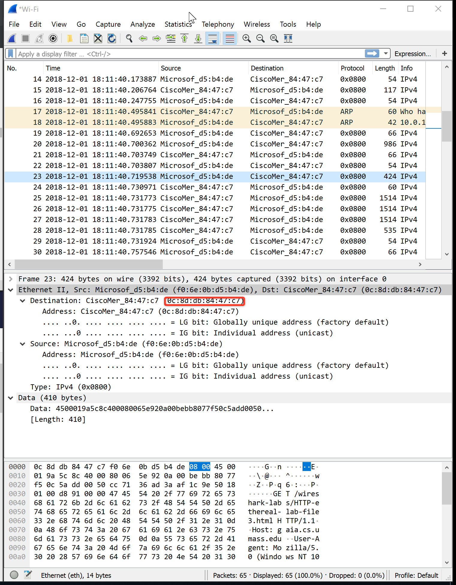
3. Give the hexadecimal value for the two-byte Frame type field. What upper layer protocol does this correspond to?
`0x0800` - IP
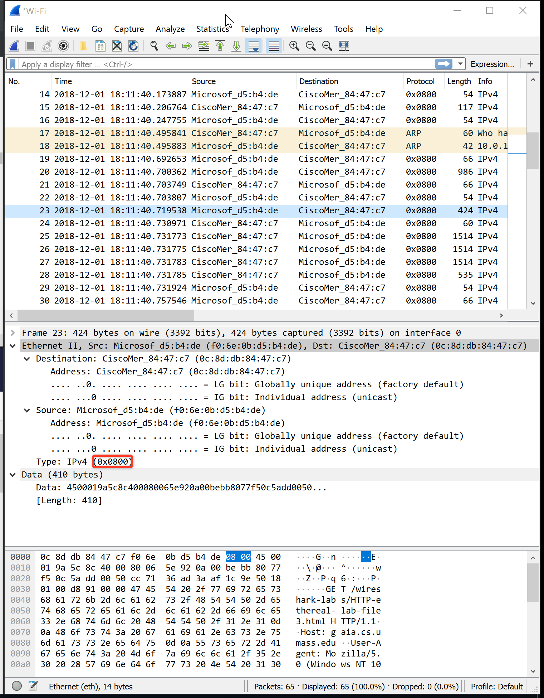
4. How many bytes from the very start of the Ethernet frame does the ASCII "G" in "GET" appear in the Ethernet frame?
`54 bytes`
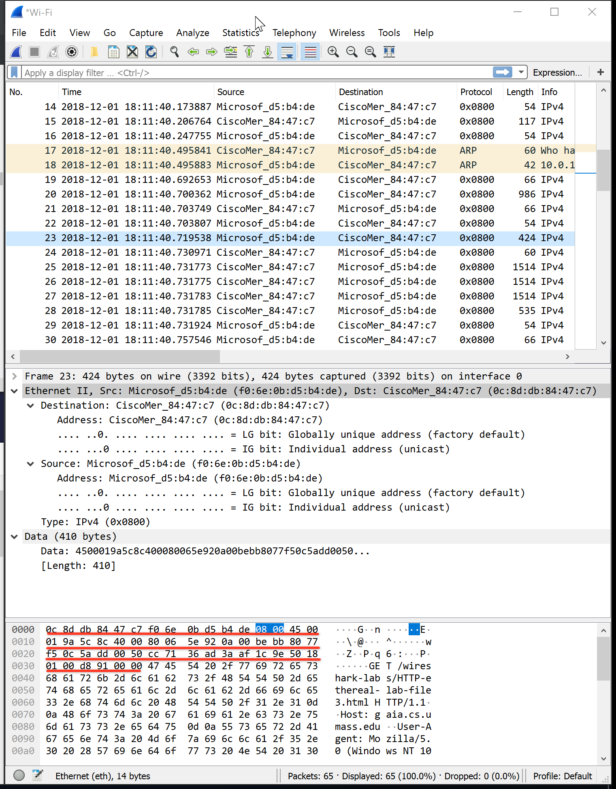
5. What is the value of the Ethernet source address? Is this the address of your computer, or of gaia.cs.umass.edu (Hint: the answer is no). What device has this as its Ethernet address?
`0c:8d:db:84:47:c7`
This is the Ethernet address of the router that I am connected to.
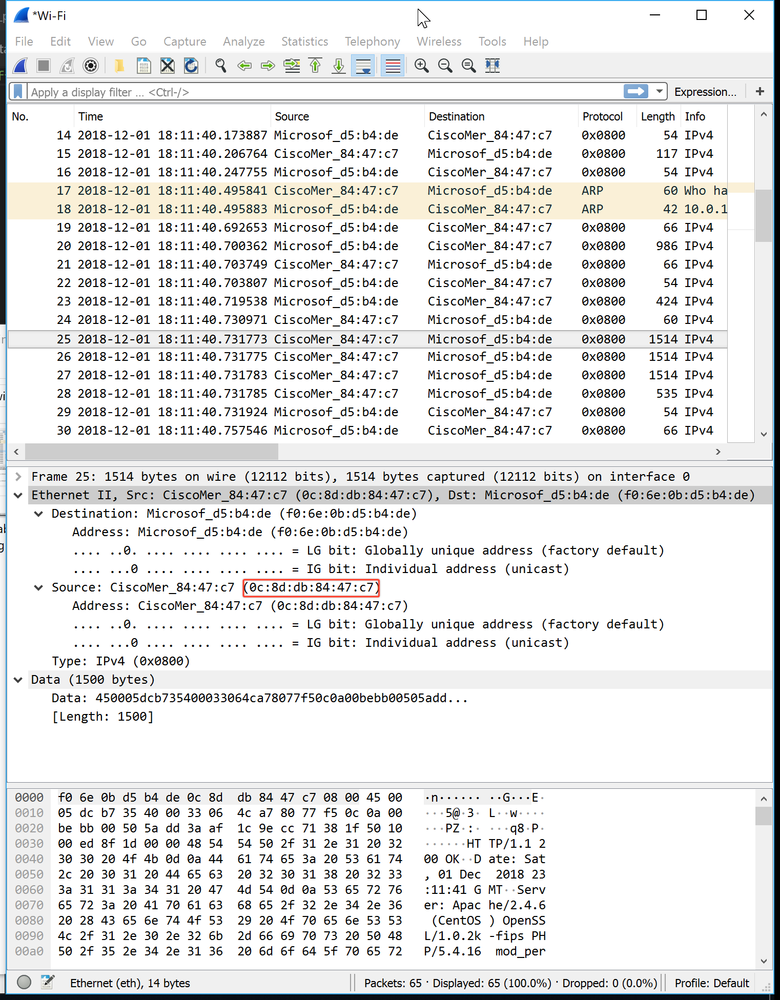
6. What is the destination address in the Ethernet frame? Is this the Ethernet address of your computer?
`f0:6e:0b:d5:b4:de`
Yes, this is the Ethernet address of my network adapter.
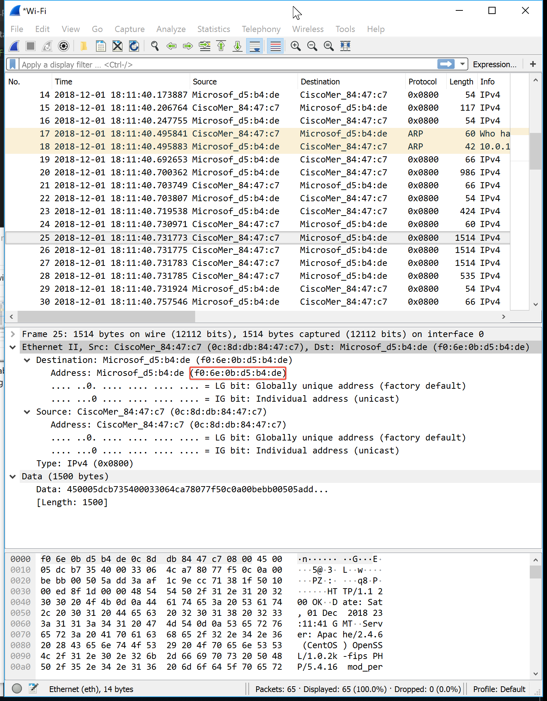
7. Give the hexadecimal value for the two-byte Frame type field. What upper layer protocol does this correspond to?
`0x0800` - IP
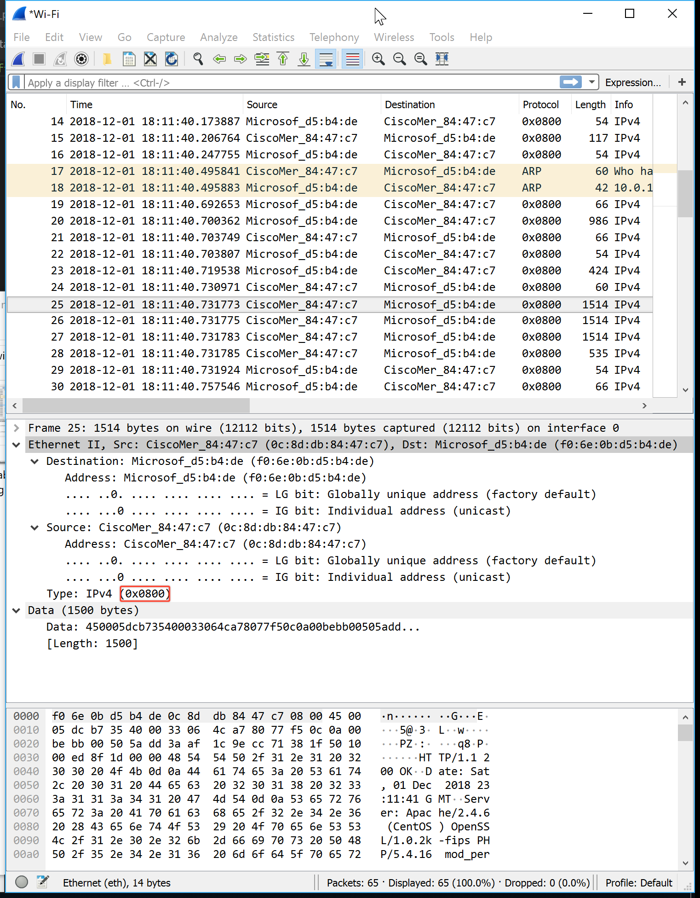
8. How many bytes from the very start of the Ethernet frame does the ASCII "O" in "OK" (i.e., the HTTP response code) appear in the Ethernet frame?
`67 bytes`
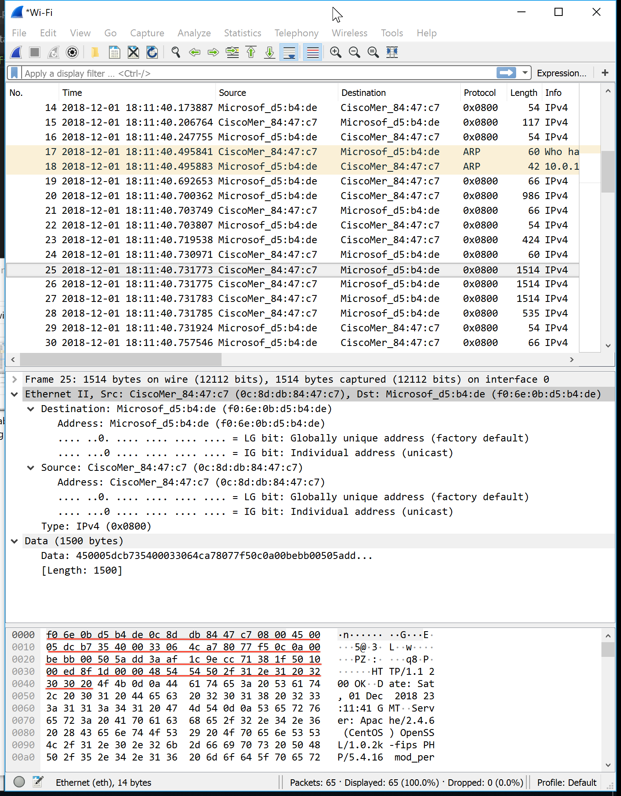
## ARP

9. Write down the contents of your computer’s ARP cache. What is the meaning of each column value?
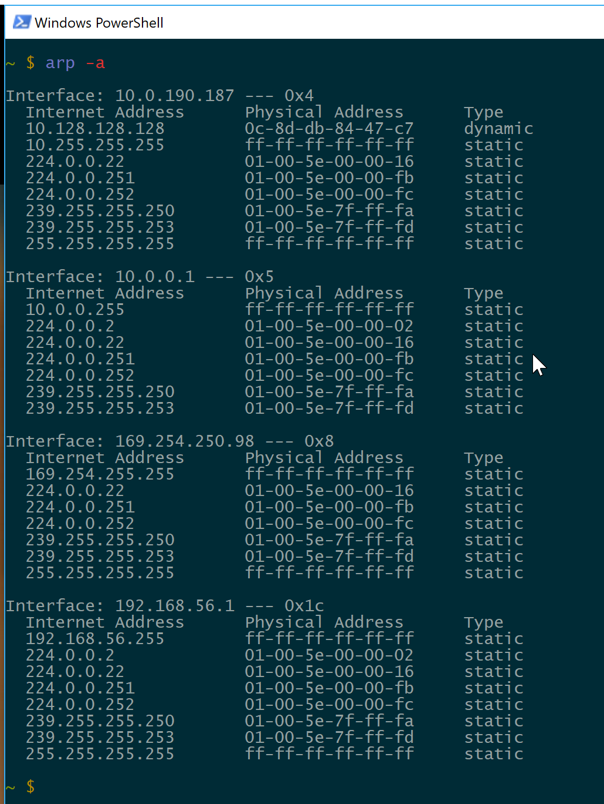
IP Address, MAC (Ethernet Address), ARP Entry Type - Static is manually configured and is permanent, Dynamic means the entry is created using the ARP protocol.
10. What are the hexadecimal values for the source and destination addresses in the Ethernet frame containing the ARP request message?
Destination: `f0:6e:0b:d5:b4:de`  
Source: `0c:8d:db:84:47:c7`  
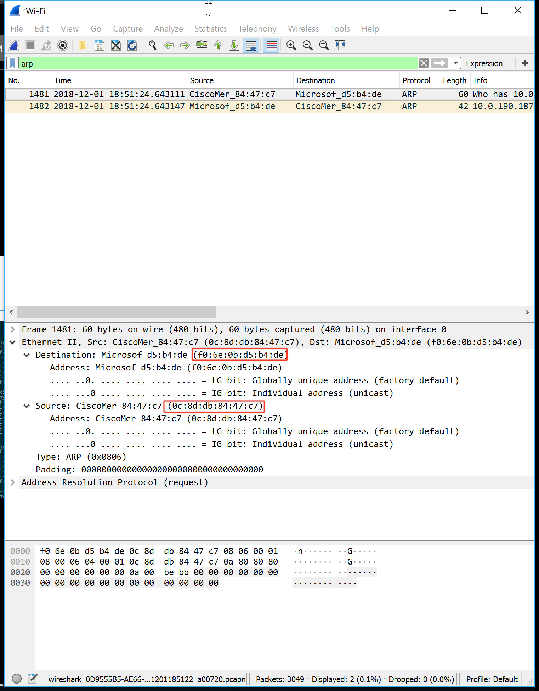
11. Give the hexadecimal value for the two-byte Ethernet Frame type field. What upper layer protocol does this correspond to?
`0x0806` - ARP  
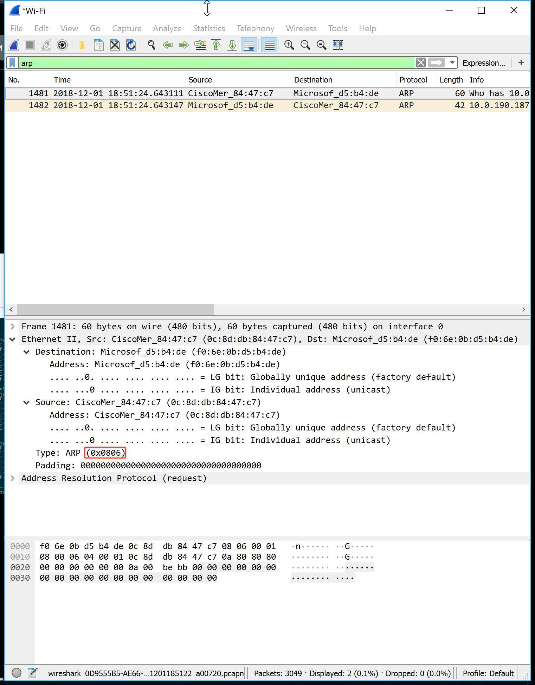
12. Download the ARP specification from ftp://ftp.rfc-editor.org/in-notes/std/std37.txt. A readable, detailed discussion of ARP is also at http://www.erg.abdn.ac.uk/users/gorry/course/inet-pages/arp.html.
    a) How many bytes from the very beginning of the Ethernet frame does the ARP opcode field begin?
    20 bytes from the beginning of the frame
    b) What is the value of the opcode field within the ARP-payload part of the Ethernet frame in which an ARP request is made?
    The hex value in the ARP-payload of the request is `0x0001`
    c) Does the ARP message contain the IP address of the sender?
    Yes
    d) Where in the ARP request does the “question” appear – the Ethernet address of the machine whose corresponding IP address is being queried?
    The field `Target MAC Address` is set to `00:00:00:00:00:00` to query the machine whose IP address is being queried.
13. Now find the ARP reply that was sent in response to the ARP request.
    a) How many bytes from the very beginning of the Ethernet frame does the ARP opcode field begin?
    20 byes from the beginning of the frame
    b) What is the value of the opcode field within the ARP-payload part of the Ethernet frame in which an ARP response is made?
    `0x0002` - 2
    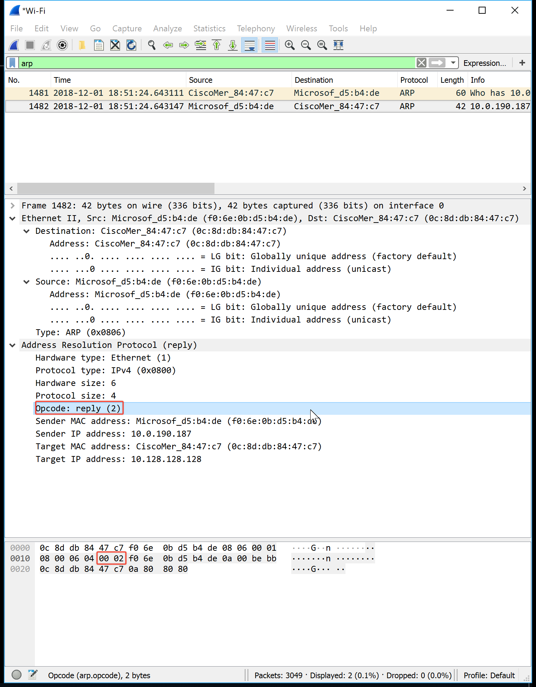
    c) Where in the ARP message does the “answer” to the earlier ARP request appear – the IP address of the machine having the Ethernet address whose corresponding IP address is being queried?
    The answer appears in the `Sender MAC Address` field. Value contains `f0:6e:0b:d5:b4:de` 
14. What are the hexadecimal values for the source and destination addresses in the Ethernet frame containing the ARP reply message?
Destination: `0c:8d:db:84:47:c7`  
Source: `f0:6e:0b:d5:b4:de`  
15. Open the ethernet-ethereal-trace-1 trace file in http://gaia.cs.umass.edu/wireshark-labs/wireshark-traces.zip. The first and second ARP packets in this trace correspond to an ARP request sent by the computer running Wireshark, and the ARP reply sent to the computer running Wireshark by the computer with the ARP-requested Ethernet address. But there is yet another computer on this network, as indicated by packet 6 – another ARP request. Why is there no ARP reply (sent in response to the ARP request in packet 6) in the packet trace?
There is no reply because this request came from a different host. It is a broadcast, but the reply will be sent to the sender's MAC address.
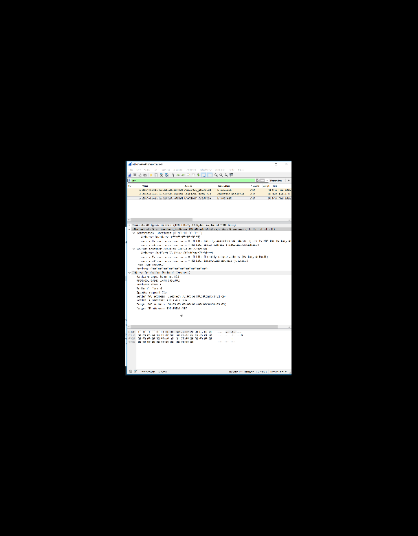